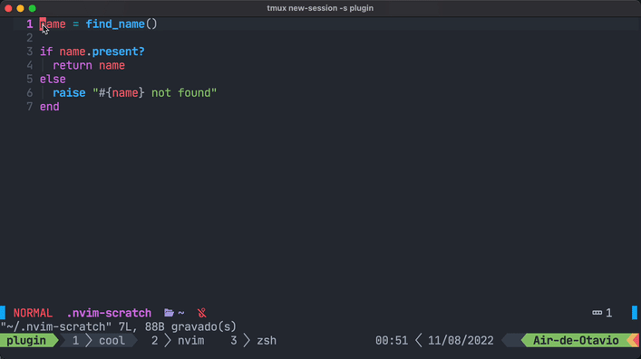
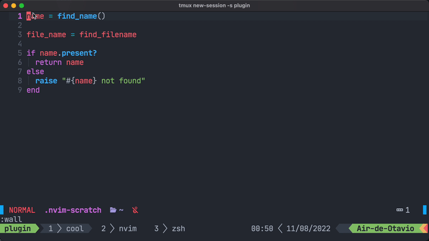
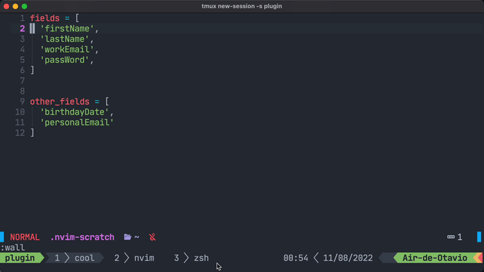
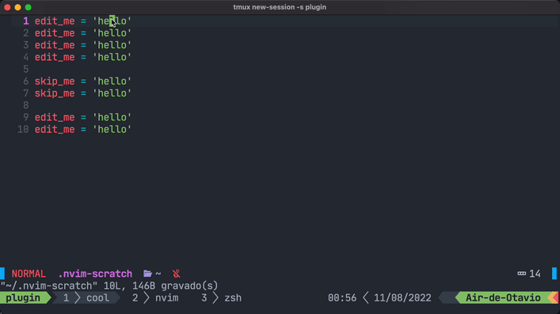

# cool-substitute

It's a simple and fast substitute for neovim.  Can easily replace multiple-cursors.  Everything it uses are simple macros and search for quickly substitute.  It is made to be used as a complement for the powerful vim builtin substitute.

* Pros:

- Easy to use
- Can use you own mappings and plugins to edit the selection
- Its 100% lua

* Cons:

- Autocomplete doesn't works while editing.

# Setup

## Packer

```lua
use { '~/Projetos/cool-substitute'}

require'cool-substitute'.setup({
  setup_keybindings = true,
  -- mappings = {
  --   start = 'gm', -- Mark word / region
  --   start_and_edit = 'gM', -- Mark word / region and also edit
  --   start_and_edit_word = 'g!M', -- Mark word / region and also edit.  Edit only full word.
  --   start_word = 'g!m', -- Mark word / region. Edit only full word
  --   apply_substitute_and_next = 'M', -- Start substitution / Go to next substitution
  --   apply_substitute_and_prev = '<C-b>', -- same as M but backwards
  --   apply_substitute_all = 'ga', -- Substitute all
  -- }
})
```

# Configuring your statusline

You can add in your statusline using those functions:

```lua
require('cool-substitute.status').status_with_icons -- return status with icons (nerdfonts)
require('cool-substitute.status').status_no_icons -- return status without icons
require('cool-substitute.status').status_color() -- return the color depending on the status of editing
```

Example for lualine:
```lua
{
  require('cool-substitute.status').status_with_icons,
  color = function() return { fg = require('cool-substitute.status').status_color() } end
}
```

# Example of usages

On word / region, press `gm` or `gM` to start.  Do the changes (you can go outside the word too).
Then keep pressing `M` to start substitution.  Press n to skip a word and press <esc> do stop the substitutions.

## Pratical example 1:

Just changing all the ocurrences with ga.

Commands: `gM` and `ga`.



## Pratical example 2:

Same as 1, but using g!M instead to only change full word (not matches inside other words)



## Pratical example 3:

using gm to mark the places, then using `nicwest/vim-camelsnek` plugin to change the cases



## Pratical example 3:

Marking with gm, then using U to uppercase stuff, and x to remove.  Also skipping some words.



# Similar plugins

### vim-visual-edit

link: https://github.com/mg979/vim-visual-multi

Pros of cool-substitute:

- Don't have any problems with other plugins, vim-visual-edit doesn't works with whichkey.
- Can use you own functions / plugins to edit
- Easier to use

Cons:

- Don't have some cool methods to edit stuff
- vim-visual-edit has support for autocomplete.

### vim-multiple-cursors

Link: https://github.com/terryma/vim-multiple-cursors

Pros of cool-substitute:

- Can use your own functions / plugins to edit
- still maintained

Cons:

- Is not really a multiple cursors.
